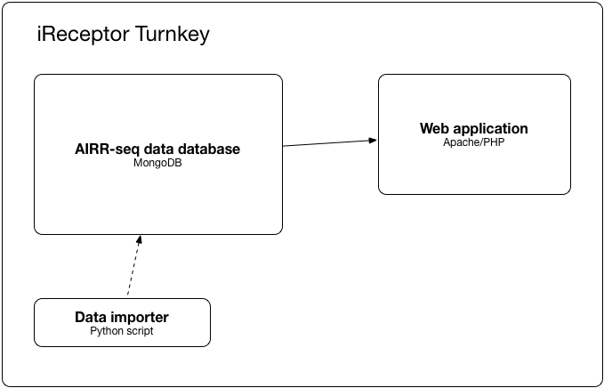

# iReceptor Turnkey

The iReceptor Turnkey is a quick and easy mechanism for a researcher or research group to install and manage an [AIRR-seq data](https://www.nature.com/articles/ni.3873) repository. In addition, the included iReceptor Web Service makes it possible to integrate the repository into the [AIRR Data Commons](http://ireceptor.org/). 

For more information, refer to the [iReceptor Turnkey](http://www.ireceptor.org/repositories#turnkey) section on the main [iReceptor web site](http://www.ireceptor.org/).

The remainder of this document provides directions on how to install and run the iReceptor Turnkey.

## What is it?
- a database
- a web application exposing that database through the [iReceptor API](https://github.com/sfu-ireceptor/api)
- some scripts to load your data into the database



## How does it work?
Docker containers are used to make the installation and future updates clean and simple. For more information, see [How it works](doc/how_it_works.md).

## Installation
Get the code and launch the installation. It will take 10-30 min, depending on the download speed.
```
git clone --branch production https://github.com/sfu-ireceptor/turnkey-service-php.git
cd turnkey-service-php
scripts/install_turnkey.sh
```

## Check it's working

Go to <http://localhost/v2/samples> in your browser (if necessary, replace "localhost" with your server URL).

This returns the list of samples in your database by querying the web application at `/v2/samples`, which is an entry point of the [iReceptor API](https://github.com/sfu-ireceptor/api). An empty array `[]` is returned because the database is currently empty.

You can also use the command line:
```
curl -X POST -H "Content-Type: application/x-www-form-urlencoded" "http://localhost/v2/samples"
```

## Loading data

#### General procedure
1. load the metadata associated with a study that has generated sequence data.
2. load the sequence annotations (from imgt, mixcr, etc).

#### Quick example: loading the test data

1. Load the metadata file [test_data/metadata_mixcr.csv](test_data/metadata_mixcr.csv):
```
scripts/load_metadata.sh test_data/metadata_mixcr.csv
```

To check it worked, go to <http://localhost/v2/samples> or execute:
```
curl -X POST -H "Content-Type: application/x-www-form-urlencoded" "http://localhost/v2/samples"
```

2. Load the associated sequence annotations file [test_data/rearrangements_mixcr.txt](test_data/rearrangements_mixcr.txt):
```
scripts/load_rearrangements.sh mixcr test_data/rearrangements_mixcr.txt
```

To check it worked, go to <http://localhost/v2/sequences_summary> or execute:
```
curl -X POST -H "Content-Type: application/x-www-form-urlencoded" "http://localhost/v2/sequences_summary"
```

Note: to load IMGT or AIRR annotations, replace the `mixcr` parameter by `imgt` or `airr`. Example:
```
scripts/load_rearrangements.sh imgt <IMGT file>
```

Congratulations :relaxed: You can now [reset the turnkey database](doc/resetting.md) and load your own data.

## Loading large data sets

The above scripts can be used to load large data sets. In particular, the load_rearrangements.sh script can be used to load many rearrangement files in a row. We recommend following a well structured data curation process to help ensure data provenance around your data management. Please refer to the iReceptor Curation process and the iReceptor Curation GitHub repository for more information on recommended data curation approaches.

Assuming all data for a study can be found in a single directory, it is possible to utilize the two commands described above to load the entire study data. Assuming your data is in a folder called STUDY_DATA, the study metadata is stored in a metadata file called METADATA.csv, and all of your rearrangement files are MiXCR .txt files, you can do the following:

1. To load your Repertiore Metadata use the load_metadata.sh scrip as above:

```
scripts/load_metadata.sh STUDY_FOLDER/METADATA.csv
```

2. To load your rearrangement data, use the load_rearrangements.sh as given below:

```
scripts/load_rearrangements.sh mixcr STUDY_FOLDER/*.txt
```
It is important to note that depending on the size of the data in your rearrangement files, loading the rearrangements can take a very long time. As a result, it is good practice to use the Unix "nohup" command to control the rearrantement loading. The Unix nohup command allows you to run a long running command in the background, redirects the output of that command to a file, and allows you to log out and come back to check on the progress of your command later. You would use the nohup command as follows:
```
nohup scripts/load_rearrangements.sh mixcr STUDY_FOLDER/*.txt > rearrangement.log &
```
Also note that both the load_metadata.sh and the load_rearrangement.sh command produce log files for every file that they process. If you want to view the log files simply refere to the files in the log directory. Log files are named using date and the file that was processed.

## More information
- [How it works](doc/how_it_works.md)
- [Troubleshooting](doc/troubleshooting.md) :hammer:
- [Backing up and restoring the database](doc/database_backup.md)
- [Moving the database to another folder](doc/moving_the_database_folder.md)
- [Updating the turnkey](doc/updating.md)
- [Resetting the turnkey database](doc/resetting.md)

## Contact us
:envelope: <support@ireceptor.org>
