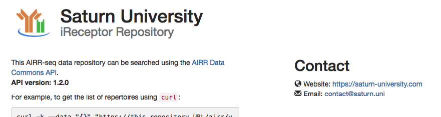

# Customizing the home page

How to customize the web page at https://&lt;your server IP&gt; (also visible at https://localhost).


## Solution 1 (recommended) - Changing the defaults

### Create a ``.env`` file
```
cp scripts/.env-custom scripts/.env
```

### Customize ``.env``
The defaults are:
```
AIRR_INFO_TITLE=iReceptor Service
AIRR_INFO_CONTACT_EMAIL=support@test-repository.com
AIRR_INFO_CONTACT_URL=https://test-repository.com
```

Change the values. For example:
```
AIRR_INFO_TITLE=Saturn University
AIRR_INFO_CONTACT_EMAIL=contact@saturn.uni
AIRR_INFO_CONTACT_URL=https://saturn-university.com
```

### Restart the turnkey
```
scripts/stop_turnkey.sh
scripts/start_turnkey.sh
```

### Check it worked

Go to your turnkey root URL https://&lt;your server IP&gt;:

<kbd></kbd>


Note: the JSON response returned by the API at `/airr/v1/info` has also been updated:
```
$ curl -k https://localhost/airr/v1/info
{
    "title": "Saturn University",
    "description": "AIRR Data Commons API for iReceptor",
    "version": "3.0",
    "contact": {
        "url": "https://saturn-university.com",
        "email": "contact@saturn.uni"
    },
    "license": {
        "name": "GNU LGPL V3"
    },
    ...
```


### Reverting to the default values

To remove your changes, delete the ``.env`` file and restart the turnkey:
```
rm scripts/.env
scripts/stop_turnkey.sh
scripts/start_turnkey.sh
```


## Solution 2 - Building a custom home page

Create an ``index.html`` file in the ``.home`` folder. That page will then be displayed, instead of the default home page.

Note: you can add to the ``.home`` folder any other required files: CSS, Javascript, images, other HTML files, etc.
