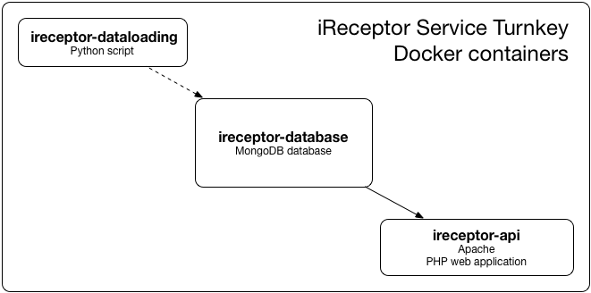
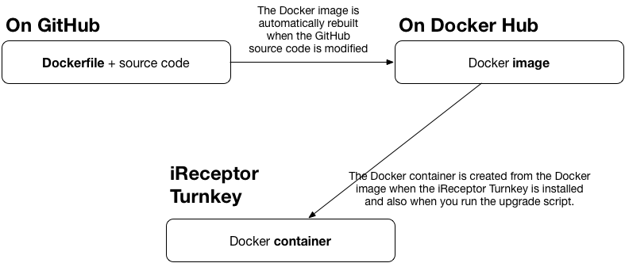

# How it works

## Software stack
- Database: [MongoDB](https://www.mongodb.com/what-is-mongodb)
- Web server: Apache
- Web application: [Laravel](https://laravel.com/) framework (PHP)
- [Docker](https://www.docker.com/why-docker) to run the database and the web application in contained environments

## Docker
Nothing is installed directly on your machine, except for Docker. The database and the web application run in Docker containers, which are plain Linux processes creating subprocesses for what it needs to run (the database and the web application). The two Docker containers communicate across a virtual private network. When importing data, a third Docker container is temporarily created, running a Python script which sends data to the Docker database container.

## How the Docker containers are created

# Docker Hub images
The Docker containers are created from Docker images downloaded from [Docker Hub](https://hub.docker.com/) during the installation of the iReceptor turnkey. Here are the Docker Hub links for each Docker container:

- Docker image for ireceptor-dataloading: https://hub.docker.com/r/ireceptorj/dataloading-mongo
- Docker image for ireceptor-database: https://hub.docker.com/r/ireceptorj/repository-mongodb
- Docker image for ireceptor-api: https://hub.docker.com/r/ireceptorj/service-php-mongodb

# GitHub repositories
Each Docker image on Docker Hub is generated from a GitHub repository. Here are the GitHub repositories for each Docker image:
- https://github.com/sfu-ireceptor/dataloading-mongo
- https://github.com/sfu-ireceptor/repository-mongodb
- https://github.com/sfu-ireceptor/service-php-mongodb

# Docker files
In each GitHub repository, there's a file named `Dockerfile` which contains the instructions to build the proper environment for the source code.

