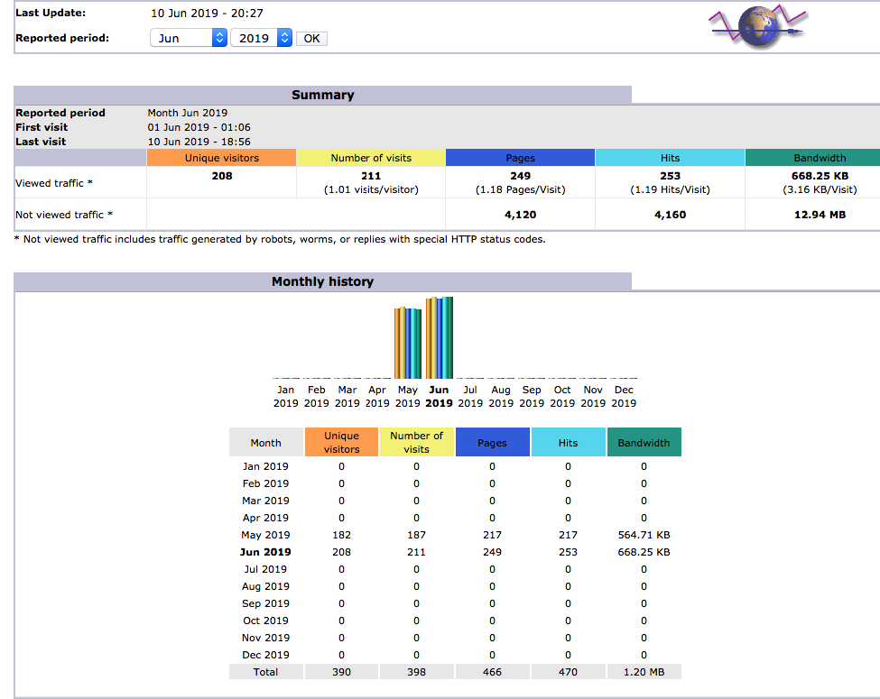
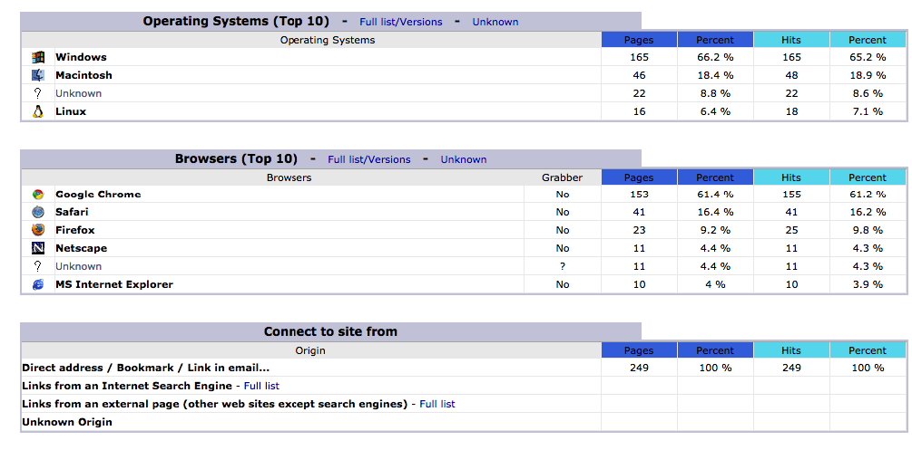

# Web statistics

[AWStats](https://awstats.sourceforge.io/) is a free and open source tool which analyzes web servers log files and generates usage reports. To turn it on on your turnkey, execute:
```
scripts/start_web_stats.sh 
```

Your usage report is now available at <http://localhost:8088> (if necessary, replace "localhost" with your server URL). 

To turn AWStats off:
```
scripts/stop_web_stats.sh 
```

Notes:
- Your AWstats page is accessible to anyone by default. You can prevent that with a dedicated firewall rule, or by turning on your web stats only when you need to look at them.
- When your turn off your turnkey (using the stop_turnkey.sh script), your AWstats page will be shutdown as well.

## How it works
The script start_web_stats.sh will:
1. dump the web server log into a file in your turnkey folder (in ./.apache_log/access.log)
2. download an [AWStats Docker image](https://hub.docker.com/r/pabra/awstats) and launch it
3. generate AWStats data from the web server log (in ./.awstats)
4. make the usage report available as an HTML page on port 8088

## What it looks like





